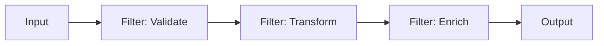
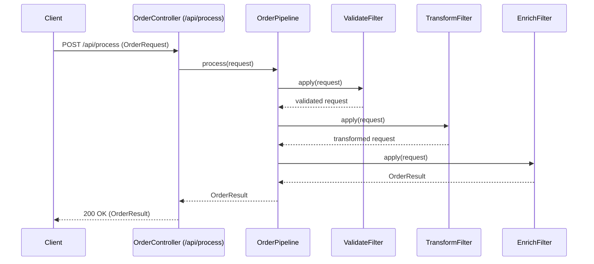

# OLA1 – Enterprise Integration Patterns and Technologies

**Course:** System Integration  
**Student:** vivek cph-vn56@stud.ek.dk  
**Repo:** https://github.com/VivekNagra/sysOLA1EnterpriseIntegration  
**Date:** 08/01/2026

## 1. Introduction
This report summarises key concepts, patterns, and concerns in enterprise integration with the goal of supporting exam preparation. It introduces common integration styles, explains why Enterprise Integration Patterns (EIP) are used in practice, and includes a working implementation of the Pipes & Filters pattern using Spring Boot. The report also discusses diagramming standards used to communicate integration designs and outlines typical security concerns that are handled at an enterprise architecture level.

## 2. What is Enterprise Integration?
Enterprise integration is the discipline of connecting applications, services, and data stores so that an organisation’s systems can exchange information and coordinate behaviour in a reliable, secure, and maintainable way. In modern software organisations, integration becomes necessary because systems rarely exist in isolation: business processes typically span multiple domains (e.g., sales, inventory, billing, analytics), and each domain may be implemented and maintained by different teams, using different technologies and deployment cadences. Enterprise integration therefore focuses on the “glue” between systems—contracts, messaging, APIs, transformation, routing, and governance—rather than only the internal design of a single application.

Integration challenges exist in both monolithic and microservice architectures. In a monolith, internal modules can communicate via in-process calls, but integration still exists at the boundaries (external partners, identity providers, payment gateways, reporting pipelines, etc.). In a microservice architecture, integration is more explicit because services communicate over a network and operate independently. This increases the importance of stable interfaces, versioning, backward compatibility, observability, and resilience. A practical definition of enterprise integration is therefore: enabling end-to-end business capabilities across heterogeneous systems while managing coupling, failure modes, security, and change over time.

## 3. Integration styles
A common starting point for integration is point-to-point communication, where one system calls another directly via HTTP, database links, or custom protocols. Point-to-point is simple at small scale, but as the number of systems grows it tends to create a “spaghetti” topology in which changes to one interface ripple through multiple consumers. The resulting coupling increases maintenance cost and makes it difficult to standardise security, logging, and governance.

An alternative is hub-based integration, historically associated with the Enterprise Service Bus (ESB). In this approach a central component handles mediation tasks such as routing, transformation, protocol bridging, and orchestration. ESB can improve visibility and governance, but it can also become a bottleneck and a single point where too much logic accumulates. In practice, many organisations have moved away from “smart bus” designs toward decentralised integration, where services own their contracts and integration responsibilities are distributed across teams.

API-led integration is a modern approach where systems expose capabilities through well-defined APIs and are typically fronted by an API gateway. The gateway provides cross-cutting concerns such as authentication, rate limiting, request validation, and monitoring, while the services themselves implement domain logic. API-led integration works well for synchronous request/response use cases, particularly when the caller needs immediate feedback (e.g., placing an order or fetching a customer profile).

Event-driven integration complements APIs by enabling asynchronous communication. Instead of calling a service directly, systems publish events (facts about something that happened), and other systems subscribe to those events. This reduces temporal coupling and improves scalability, but introduces additional complexity: eventual consistency, out-of-order delivery, idempotency, and debugging across asynchronous flows. In practice, real enterprise systems often combine these styles, using APIs for synchronous user flows and events for cross-system propagation and integration.

## 4. Enterprise Integration Patterns (EIP)
Enterprise Integration Patterns (EIP) describe reusable solutions to recurring integration problems in messaging systems and distributed architectures. Patterns are valuable in enterprise settings because integration problems tend to repeat across projects: systems need to validate, transform, enrich, and route messages; they must cope with failures and retries; and they must remain observable and governable as they evolve. Using a common pattern vocabulary improves communication between developers and architects and supports consistent design decisions.

A central theme in EIP is the separation of concerns between endpoints and the “integration logic” in the middle. Endpoints produce or consume data, while the integration layer handles cross-cutting steps such as transformation, routing decisions, and coordination. This separation helps limit coupling by keeping domain services focused on business responsibilities and moving message manipulation into composable integration components. Many patterns also emphasise operational robustness: idempotent consumers to tolerate duplicate messages, correlation identifiers for tracing, and dead-letter handling for poison messages. These concerns are not optional in enterprise environments because failures are expected rather than exceptional, especially when multiple independently deployed systems are involved.

## 5. Working example: Pipes and Filters
### 5.1 Pattern explanation
The Pipes & Filters pattern structures processing as a sequence of independent steps (“filters”) connected by “pipes”. Each filter performs a single responsibility such as validation, transformation, or enrichment, and forwards the result to the next filter. This improves maintainability because filters can be tested independently, reordered, replaced, or extended without changing the entire flow. In enterprise integration, the pattern is commonly used for message processing pipelines, ETL-like flows, and integration middleware where data needs to be standardised and enriched before reaching downstream systems.

### 5.2 Diagram (high-level)


### 5.3 Interaction diagram

### 5.4 Implementation (Spring Boot)
The demo exposes a REST endpoint **POST /api/process** that executes a pipeline consisting of three filters:

- ValidateFilter performs domain rule validation (example: a quantity upper bound).
- TransformFilter normalises the item field (trim + uppercase).
- EnrichFilter enriches the message with a derived attribute riskLevel based on quantity.

This demonstrates the Pipes & Filters pattern by decomposing processing steps into independent components that can be composed and extended.

**Run:** .\gradlew.bat bootRun

**Test:** 
```powershell
$body = @{
  orderId    = "O-1001"
  customerId = "C-77"
  quantity   = 120
  item       = "  usb cable  "
} | ConvertTo-Json

Invoke-RestMethod -Method Post `
  -Uri "http://localhost:8080/api/process" `
  -ContentType "application/json" `
  -Body $body
```
For full run and test instructions, læs : demo-pipes-filters/pipes-filters-demo/README.md

## 6. Diagramming standards and tools

Diagramming is a critical part of enterprise integration because integration often fails in practice due to misunderstandings about boundaries, responsibilities, and data flow. Different notations serve different audiences and levels of abstraction, and it is common to combine notations to communicate both the big picture and the detailed behaviour of an interaction.

UML is widely used in software engineering to describe structure and behaviour. For integration, sequence diagrams can clarify synchronous request/response flows, and component diagrams can clarify dependencies between services, gateways, brokers, and databases. UML is particularly effective when discussing failure paths (timeouts, retries, fallback behaviour) and when documenting contracts between systems. However, UML can become too detailed if used as an “everything diagram,” so it is best used selectively.

BPMN is a process modelling notation that is useful when integration is driven by business workflows. BPMN can show human tasks, automated service tasks, and decision gateways in a way that is accessible to both technical and business stakeholders. In integration projects, BPMN is especially relevant when multiple systems collaborate to implement a business process (for example, onboarding, order fulfilment, or incident handling). BPMN also helps clarify where orchestration exists and which system is responsible for each step.

The C4 model is a pragmatic approach to architecture communication that uses multiple views: context, container, component, and code. In integration discussions, a context diagram clarifies the external actors and systems, while a container diagram clarifies how the system is decomposed into deployable units (services, message brokers, gateways). The C4 model is effective because it encourages “zooming” from high-level to detail only when needed, which prevents diagrams from becoming unreadable. In this project, Mermaid diagrams are used to express integration flows in a lightweight and version-controlled way, ensuring diagrams evolve together with the code.

## 7. Security concerns at EA level

Security in enterprise integration is primarily about managing trust boundaries between systems and standardising controls across heterogeneous technology stacks. At an enterprise architecture level, the goal is to enable teams to integrate quickly without repeatedly re-implementing security concerns inconsistently. This typically leads to centralised capabilities such as identity providers, API gateways, certificate management, and audit logging, while still allowing teams to own their services and data.

A core concern is identity and access management. Modern enterprise integration commonly relies on standards such as OAuth 2.0 and OpenID Connect to authenticate users and services and to propagate identity in a controlled way. For service-to-service communication, this is often paired with short-lived tokens, token validation at the edge, and least-privilege authorization using scopes/claims. An API gateway can enforce consistent policies such as authentication, rate limiting, schema validation, and request size limits, which reduces the risk that a single service becomes the weak link.

Data protection is another major concern. Integration frequently involves sensitive data moving between systems, including personal data, financial information, or operationally critical data. The enterprise baseline should include TLS in transit, careful management of secrets (avoid embedding secrets in repos; use a vault/KMS approach), and encryption at rest where appropriate. Additionally, enterprise systems must produce reliable audit trails. That requires structured logs, correlation IDs across services, distributed tracing, and centralised monitoring. These capabilities are essential for incident response and compliance, and they also reduce the operational cost of debugging integration failures.

Finally, resilience and abuse prevention are part of security in practice. Rate limiting, circuit breakers, retries with backoff, and dead-letter handling help protect systems from cascading failures and message storms. At the EA level, the enterprise should define patterns and reference architectures for these controls so teams can adopt them consistently. This aligns security with reliability and makes integration safer as the number of connected systems grows.

## 8. Conclusion

Enterprise integration is necessary because real-world systems span multiple teams, technologies, and domains. Different integration styles—point-to-point, hub-based mediation, API-led connectivity, and event-driven communication—address different needs and trade-offs, and most enterprise systems use a combination of them. Enterprise Integration Patterns provide a shared vocabulary and proven solutions for structuring these integrations in a way that is maintainable and operationally robust.

The Pipes & Filters demo illustrates how a processing flow can be decomposed into independent steps for validation, transformation, and enrichment. This structure supports modularity and makes it easier to extend or replace processing logic without redesigning the entire flow. Finally, enterprise-scale integration requires consistent diagramming practices for communication and strong security baselines—identity, access control, data protection, and observability—to manage risk across many connected systems.