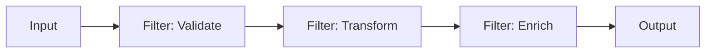

# OLA1 – Enterprise Integration Patterns and Technologies

**Course:** System Integration  
**Student:** <Your full name>  
**Repo:** <repo link>  
**Date:** <date>

## 1. Introduction
(What this report covers and why enterprise integration matters.)

## 2. What is Enterprise Integration?
(Definition + why it exists in scalable distributed systems.)

## 3. Integration styles
- Point-to-point
- ESB
- API-led connectivity
- Event-driven architecture

## 4. Enterprise Integration Patterns (EIP)
(Overview + why patterns matter.)

## 5. Working example: Pipes and Filters
### 5.1 Pattern explanation
### 5.2 Diagram

### 5.3 Implementation (Spring Boot)
The demo exposes a REST endpoint `POST /api/process` that executes a pipeline consisting of three filters:

1. **ValidateFilter**: domain rule validation (e.g., quantity upper bound)
2. **TransformFilter**: normalizes `item` (trim + uppercase)
3. **EnrichFilter**: enriches the message with a derived attribute `riskLevel` based on `quantity`

This demonstrates the **Pipes & Filters** pattern by decomposing processing steps into independent components that can be composed and extended.

**Run:** `.\gradlew.bat bootRun`  
**Test:** see `demo-pibes-filters/pipes-filters-demo/pibesfiltersdemo/README.md`

# 6.
- UML
- BPMN
- C4 model (optional but useful)

# 7. Security concerns at EA level
- Identity (OIDC/OAuth2)
- API Gateway concerns
- Secrets management 
- Logging, tracing, audit 
- Data protection (TLS, Encryption at rest, PII)

# Conclusion 

